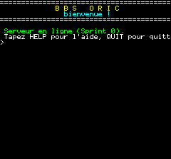
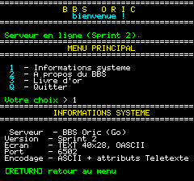

# Test pipeline with the local Oric emulator

This project benefits from a **100% local test environment, with no external hardware or network**.

> ⚠️ **Reference emulator: `/home/bmarty/Oric1/oric1-emu` ONLY.**
> It is the only binary to use for testing the BBS. Do NOT use `oric2/Phosphoric`
> (sources/tests from another project) nor other copies.

## Available local resources

| Resource | Location | Role |
|----------|----------|------|
| **oric1-emu** (Phosphoric v1.21.x) | `/home/bmarty/Oric1/oric1-emu` | **Reference emulator**: Oric-1 with ACIA + configurable serial |
| picowifi modem | `~/.phosphoric_picowifi.cfg` | Emulated WiFi modem, already configured in telnet (call book) |

## Serial support in oric1-emu (Phosphoric)

```
--serial TYPE     loopback | tcp:H:P | pty | modem:H:P |
                  com:B,D,P,S,DEV | file:IN[:OUT] | picowifi[:SSID[:PASS]]
--serial-v23      V23 mode 1200/75 (Minitel/Prestel)
--serial-baud N   realistic 6551 ACIA timing
--serial-trace F  timestamped TX/RX trace (debug)
--acia-addr ADDR  ACIA base in hex (default 031C)
--loci            LOCI MIA at $03A0-$03BF
```

## Recommended test pipeline

### 1. Start the BBS server
```bash
cd /home/bmarty/bbsoric
go run ./cmd/bbsd -addr 127.0.0.1:6502
```

### 2a. Direct ACIA → BBS connection (simplest)
The emulator links its ACIA to our server via a TCP socket. On the Oric side, the terminal
[`oric-client/term.s`](../oric-client/term.s) reads the ACIA `$031C` and writes to VRAM.

**Validated and automated procedure** (Sprint 1):
```bash
oric-client/build.sh                 # term.s -> term.tap (autorun, loads at $1000)
scripts/test-emulateur.sh /tmp/oric.ppm
```
The script starts the server, launches the emulator **headless** connected over TCP serial,
then captures the screen. Validated key points:
- ROM **mandatory**: `-r roms/basic11b.rom` (otherwise the machine does not boot, PC stays at 0).
- Fast-load `-f`: the terminal is injected at `$1000` around ~3M cycles, capture at 6.5M.
- RX FIFO `--serial-buffer 512`: absorbs the banner during boot.

**Reference result** — the colored banner displays correctly, proving the rendering
of OASCII serial attributes:



The `--serial-trace FILE` trace details each TX/RX byte (useful to diagnose
Teletext attributes or check the keyboard strokes emitted).

### 2c. Test keyboard emission (TX) and navigation
`--type-keys 'C:TEXT'` injects keystrokes after C cycles (`\n`=RETURN, `\pN`=pause N s).
Example — choose menu entry 1 then confirm:
```bash
oric1-emu ... --type-keys '6000000:1\p2\n' --screenshot-at 9500000:/tmp/nav.ppm -c 10000000
```
Reference result — entering `1` + RETURN → "System information" screen:



> ⚠️ Space out keystrokes (`\pN`): a very fast burst while the banner is loading
> can drop keystrokes (the terminal first drains the RX stream). A human keystroke (keys
> held ~100 ms, spaced) is captured without issue — validated: `a/b/c/RETURN` all transmitted.

### 2b. Connection via emulated modem (closer to real)
```bash
./oric1-emu --serial picowifi
# then, from the Oric: ATD 127.0.0.1:6502
```
or `--serial modem:127.0.0.1:6502` depending on the scenario.

### 3. Server-only test (without emulator)
```bash
# banner + commands
printf 'HELP\r\nQUIT\r\n' | nc 127.0.0.1 6502
```

## Integration with the real picowifi modem

`~/.phosphoric_picowifi.cfg` already contains a call book (`dial0..2`) to public BBSes.
For our server, add an entry:
```
dialN=<host-vps>:6502,bbsoric
```
> ⚠️ The picowifi is configured `tty_type=ansi, tty_w=80, tty_h=24`. The Oric in TEXT mode is
> **40 columns**: the OASCII layer (Sprint 1) will have to produce rendering suited to 40 columns,
> independently of the modem's ANSI settings.

## Note on ACIA addressing
- **oric1-emu / Telestrat**: ACIA at `$031C` by default (`--acia-addr` to change).
- **LOCI**: MIA at `$03A0-$03BF` (emulator side); the Raxiss doc also mentions the
  USB-CDC modem exposure. The Oric client will have to target the right base depending on the setup.
