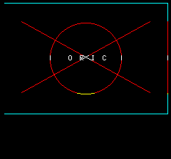

# Pages HIRES — graphisme haute résolution (240×200)

Une page **HIRES** présente un écran graphique Oric (mode haute résolution
**240×200**, VRAM `$A000`, 8000 octets) au lieu du mode TEXT 40×28. Les **3 dernières
lignes restent en TEXT** (`$BB80`) — idéal pour un menu/texte sous le décor (cf.
pattern « menu sur fond d'écran »). Voir `docs/adr/0005-hires-pages.md`.

Deux modèles, **combinables** dans une même page :

- **bitmap** (`background`) : un fond posé d'un bloc (image, logo) ;
- **primitives** (`draw`) : des commandes de tracé appliquées par-dessus.

## Déclarer une page HIRES

Dans une page du `site.json`, à la place de `lines`/`entries` :

```json
"logo": {
  "title": "LOGO",
  "hires": {
    "draw": [
      { "op": "ink",    "c": 3 },
      { "op": "curset", "x": 0,   "y": 0 },
      { "op": "box",    "x": 239, "y": 199 },
      { "op": "curset", "x": 120, "y": 100 },
      { "op": "circle", "r": 40 },
      { "op": "char",   "x": 100, "y": 96, "ch": "O" }
    ]
  }
}
```

Le **fond bitmap** (modèle « bitmap ») se déclare avec `background` : exactement
**8000 octets** de VRAM HIRES (base64 en JSON). On peut combiner `background` (posé
d'abord) **et** `draw` (par-dessus).

### Primitives (`draw`)

Le terminal maintient un **crayon** (pen). Chaque primitive :

| `op` | Champs | Effet |
|------|--------|-------|
| `ink` / `paper` | `c` (0-7) | couleur d'encre / de fond courante |
| `curset` | `x`,`y` | déplace le crayon (sans tracer) |
| `point` | `x`,`y` | allume le pixel (crayon ← x,y) |
| `line` | `x`,`y` | trace du crayon vers (x,y) (crayon ← x,y) |
| `box` | `x`,`y` | rectangle **vide** du crayon à (x,y) |
| `fillbox` | `x`,`y` | rectangle **plein** du crayon à (x,y) |
| `circle` | `r` | cercle de rayon r autour du crayon |
| `char` | `x`,`y`,`ch` | caractère ASCII tracé en (x,y) |

Bornes vérifiées au chargement (`Site.Validate`) : `x` ∈ [0,240[, `y` ∈ [0,200[,
couleurs 0-7, `background` = 8000 octets, `op` connu.

### Navigation

Une page HIRES **avec** `entries` route les touches comme un menu (les libellés sont
dessinés dans le décor ou les 3 lignes texte du bas) ; **sans** `entries`, une touche
suffit pour revenir.

## Protocole fil-de-fer (terminal)

Le serveur sérialise la page via `render.Hires` en un **flux de commandes** ouvert par
la sous-commande série **`1F FC`** (libre, hors plage colonnes ; les terminaux telnet
génériques l'ignorent). Suit une suite d'**opcodes** (`internal/oascii/hires.go`)
jusqu'à `HiEnd` :

| Opcode | Octet | Arguments |
|--------|-------|-----------|
| `HiEnd` | `00` | — (fin du flux → retour TEXT) |
| `HiOn` | `01` | — (bascule HIRES + efface) |
| `HiInk` / `HiPaper` | `02` / `03` | `c` |
| `HiCurset` | `10` | `x y` |
| `HiPoint` | `11` | `x y` |
| `HiLine` | `12` | `x y` |
| `HiBox` | `13` | `x y` |
| `HiFillBox` | `14` | `x y` |
| `HiCircle` | `15` | `r` |
| `HiChar` | `16` | `x y ch` |
| `HiBlit` | `20` | `off_lo off_hi len_lo len_hi <RLE>` |

Le **fond bitmap** est émis par `HiBlit` : `off`/`len` (octets décodés) puis un flux
**RLE** (paires *compteur 1-255 / valeur*) qui redécode exactement `len` octets en
`$A000+off`. Compact pour les grandes plages uniformes (un écran vide ≈ 32 paires au
lieu de 8000 octets).

## Firmware terminal (oric1-emu)

L'interpréteur HIRES vit dans `client/hires.s` (concaténé par `client/build.sh`).
À la réception de `1F FC`, `handle_rx` passe en état flux HIRES et alimente
`hires_feed`, qui exécute les opcodes :

- **bascule mode** : attribut vidéo `0x1E` posé à `$BB80` (latché par l'ULA → HIRES
  persistant), effacement de la VRAM `$A000` (8000 octets à `$40`) et des 3 lignes
  texte du bas ;
- **primitives** en 6502 *autonome* (sans ROM BASIC) : `setpixel` (`$A000 + y*40 +
  x/6`, bit `5 - x%6`), Bresenham x/y-major (16 bits), box/fillbox, cercle midpoint,
  `char` (glyphe 6×8 lu dans le charset, sauvegardé en `$9800` car `$A000` recouvre
  `$B400`) ;
- **blit bitmap** : décodeur RLE écrivant les octets décodés en `$A000+offset`.

Validé visuellement dans `oric1-emu` — terminal Oric réel → modem → BBS local
(`scripts/test-emulateur-grille.sh` adapté) :

| Primitives (démo `ORIC`) | Bitmap RLE + box |
|---|---|
|  |  |

*À gauche : cadre + cercle + diagonales + texte `ORIC` (op `char`). À droite : un fond
bitmap (bandes blanche/noire) posé par `blit`, avec un rectangle tracé par-dessus.*

### Limites connues

- **Couleur** : le rendu est monochrome (encre blanche) ; `ink`/`paper` ne posent pas
  encore d'attributs sériels dans le bitmap (incrément ultérieur).
- **Contrôle de flux** : un `blit` volumineux peut saturer le FIFO série du terminal
  (même classe que le défaut RX #1 de `docs/client-review.md`) — réservé aux fonds
  bien compressibles ; un transfert XMODEM-flow-controllé est la piste pour les
  bitmaps arbitraires.
- **Retour au TEXT** : après une page HIRES, repasser proprement en mode TEXT (restaurer
  `$B400` + attribut `0x1A`) reste à câbler (incrément ultérieur).

## Édition dans le studio Forge

Une page HIRES s'édite visuellement dans le studio (onglet **Édition**) :

- le bouton **« + page graphique (HIRES) »** convertit une page normale en page graphique ;
- un **tableau de primitives** (`draw`) : choix de l'op (`curset`/`point`/`line`/`box`/
  `fillbox`/`circle`/`char`/`ink`/`paper`) avec les champs pertinents (X/Y, R, couleur
  Oric 0-7, caractère), réordonnables (↑/↓) et supprimables ;
- un **fond bitmap** par **import d'image** : l'image est réduite en 240×200 et seuillée
  en 1 bit (luminance) pour produire le buffer VRAM (`background`) ;
- un **aperçu 240×200 en direct** : le rendu est **rastérisé en JS** (miroir exact du
  firmware `client/hires.s`), monochrome (encre blanche). La page apparaît `graphique`
  (marqueur `◨ hires`) dans le graphe de navigation.

`Valider`/`Enregistrer` passent par le même `content.Parse` que le serveur.

## État d'avancement

- **Serveur** (modèle, validation, encodeur `render.Hires`, RLE, câblage moteur, tests) : **fait**.
- **Firmware terminal** (interpréteur HIRES `term.s`/`hires.s`, primitives 6502, blit
  RLE, **validation oric1-emu**) : **fait** (slice 2).
- **Studio Forge** (éditeur de primitives + import d'image, aperçu 240×200 JS) : **fait** (slice 3).
